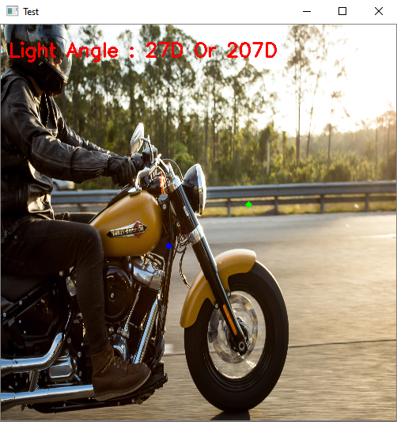

# LAD - Light Angle Detector
## Brightness Mean Algorithm
- Normal Image :          

- Converted into black and white image
- Image with only bright pixels (white mask) :           

- Image with only dark pixels (black mask) :          

- In both images, the average pixel is calculated
- Output Image :           

- In above image the Green dot indicates the white mask average pixel and the Blue dot indicates average pixel of the black mask    
#### Warning : This algorithm doesn't work 100% of the time and sometime gives wrong angle and vector. You can calculate the angle by the slope of the vector made by two points(green and blue)
